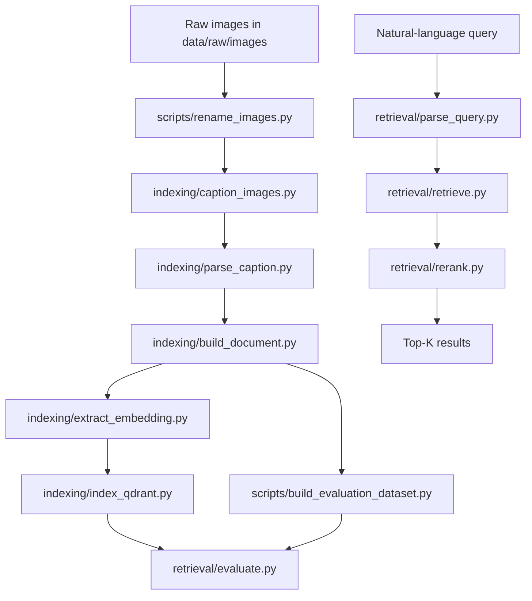

# Fashion-Faux-Pas

Multimodal fashion image retrieval from natural language queries.

This repository implements an offline indexing workflow and an online retrieval workflow for a small fashion dataset. The core idea is to improve attribute binding in queries such as "a red tie and a white shirt in a formal setting" without relying on filename matching or a learned reranker. The implementation combines dense captions, structured attribute extraction, FashionCLIP embeddings, Qdrant storage, and a deterministic reranker.

The system is designed to handle two kinds of queries:

- attribute-heavy queries, where the exact garment-color binding matters
- style-heavy queries, where semantic similarity carries more of the signal

## Motivation

Global image/text embeddings are a strong baseline for zero-shot retrieval, but they are weak at compositional binding. In fashion search, that matters because the query often specifies which attribute belongs to which garment. A single embedding can recognize the words in a query and still rank the wrong image above the right one.

This repository addresses that by separating the problem into two stages:

1. semantic recall with FashionCLIP and Qdrant
2. deterministic reranking with structured query/image attributes

The goal is not to claim perfect compositional understanding. The goal is to make the failure mode easier to reduce and easier to measure.

## System Architecture



The offline pipeline produces one canonical record per image. The online pipeline parses a user query into the same schema, retrieves candidates by semantic similarity, and reranks them with attribute overlap.

## Repository Structure

| Path | Purpose |
|---|---|
| `indexing/` | Caption generation, attribute parsing, document building, image embedding, and Qdrant indexing |
| `retrieval/` | Query parsing, semantic retrieval, deterministic reranking, and evaluation |
| `scripts/` | Image renaming and evaluation dataset generation |
| `data/raw/images/` | Input image directory |
| `data/processed/` | Intermediate JSON and NumPy artifacts |
| `data/qdrant_db/` | Local persistent Qdrant storage |
| `configs/` | Present, but no tracked config files yet |

## Dataset Preparation Pipeline

The checked-in dataset contains 512 fashion images. The scripts assume the images live under `data/raw/images/` and are normalized to sequential filenames before indexing.

### Data artifacts

| Artifact | Description | Produced by |
|---|---|---|
| `captions.json` | Dense captions keyed by filename | `indexing/caption_images.py` |
| `attributes.json` | Structured attributes extracted from captions | `indexing/parse_caption.py` |
| `documents.json` | Canonical per-image documents | `indexing/build_document.py` |
| `embeddings.npy` | FashionCLIP image embedding matrix | `indexing/extract_embedding.py` |
| `filenames.json` | Filename order aligned with embeddings | `indexing/extract_embedding.py` |
| `embedding_metadata.json` | Basic embedding-stage metadata | `indexing/extract_embedding.py` |
| `evaluation_queries.json` | Deterministic query/relevance set | `scripts/build_evaluation_dataset.py` |
| `evaluation_summary.json` | Aggregate retrieval metrics | `retrieval/evaluate.py` |

### Script reference

| Script | Purpose | Input | Output | Dependencies |
|---|---|---|---|---|
| `scripts/rename_images.py` | Rename supported images to a sequential numeric scheme | `data/raw/images/*.jpg` | Renamed `.jpg` files such as `000001.jpg` | Python stdlib only |
| `indexing/caption_images.py` | Generate dense captions with Florence-2 | Raw images | `data/processed/captions.json` | `Pillow`, `torch`, `transformers`, `tqdm` |
| `indexing/parse_caption.py` | Convert captions into structured attributes with Qwen2.5 | `captions.json` | `attributes.json` | `torch`, `pydantic`, `transformers`, `tqdm` |
| `indexing/build_document.py` | Merge captions and attributes into canonical image documents | `captions.json`, `attributes.json` | `documents.json` | Python stdlib, `tqdm` |
| `indexing/extract_embedding.py` | Compute one FashionCLIP image embedding per image | Raw images | `embeddings.npy`, `filenames.json`, `embedding_metadata.json` | `numpy`, `Pillow`, `torch`, `transformers`, `tqdm` |
| `indexing/extract_embeddings.py` | Compatibility wrapper for the embedding stage | Same as `indexing/extract_embedding.py` | Same as `indexing/extract_embedding.py` | Same as `indexing/extract_embedding.py` |
| `indexing/index_qdrant.py` | Validate alignment and index documents into local Qdrant | `documents.json`, `embeddings.npy`, `filenames.json` | Local collection under `data/qdrant_db/` | `numpy`, `qdrant-client`, `tqdm` |
| `retrieval/parse_query.py` | Parse a free-form query into the shared schema | Natural-language query string | `QueryDocument` JSON on stdout | `torch`, `pydantic`, `transformers` |
| `retrieval/retrieve.py` | Embed the query and run ANN search in Qdrant | Query text or stdin prompt | Semantic candidate list on stdout | `numpy`, `torch`, `qdrant-client`, `transformers` |
| `retrieval/rerank.py` | Combine semantic similarity and structured attribute overlap | `QueryDocument`, semantic candidates | Reranked candidate list in memory | `QueryDocument` and `RetrievedCandidate` models |
| `retrieval/evaluate.py` | Compare semantic vs. hybrid ranking on the generated evaluation set | `evaluation_queries.json`, `documents.json` | `evaluation_summary.json` and printed metrics | `torch`, `numpy`, `json`, `math`, shared retrieval modules |
| `scripts/build_evaluation_dataset.py` | Build a deterministic evaluation dataset from indexed metadata | `documents.json` | `evaluation_queries.json` | Python stdlib |

## Indexing Pipeline

### 1. Rename images

`python scripts/rename_images.py`

This script only handles `.jpg` files in `data/raw/images/`. It renames them to a sequential scheme and uses a temporary rename pass first to avoid collisions.

### 2. Generate dense captions

`python indexing/caption_images.py --input-dir data/raw/images --output-file data/processed/captions.json`

This stage uses Florence-2 to produce dense captions for each image. The output is a filename-to-caption JSON map.

### 3. Parse captions into structured attributes

`python indexing/parse_caption.py --input-file data/processed/captions.json --output-file data/processed/attributes.json`

This stage uses Qwen2.5 to extract a fixed schema from each caption:

| Field | Type |
|---|---|
| `scene` | Optional string |
| `style` | Optional string |
| `pose` | Optional string |
| `objects` | List of strings |
| `garments` | List of `{type, color, pattern}` objects |

The parser validates the model output and retries invalid responses up to the configured retry limit.

### 4. Build canonical documents

`python indexing/build_document.py --captions-file data/processed/captions.json --attributes-file data/processed/attributes.json --output-file data/processed/documents.json`

This stage merges captions and attributes into one canonical document per image. The resulting schema is also used by the query parser so the retrieval code can compare structured fields directly.

### 5. Extract image embeddings

`python indexing/extract_embedding.py --input-dir data/raw/images --embeddings-file data/processed/embeddings.npy --filenames-file data/processed/filenames.json --metadata-file data/processed/embedding_metadata.json`

This stage computes one FashionCLIP image embedding per image and stores the aligned embedding matrix, filename order, and metadata file. The wrapper `indexing/extract_embeddings.py` calls the same entry point.

### 6. Index into Qdrant

`python indexing/index_qdrant.py --documents-file data/processed/documents.json --embeddings-file data/processed/embeddings.npy --filenames-file data/processed/filenames.json --qdrant-path data/qdrant_db --collection-name fashion_images`

This stage validates that the documents, filenames, and embeddings are aligned before upserting them into a local persistent Qdrant collection. The default collection name is `fashion_images`.

## Retrieval Pipeline

### 7. Parse a query

`python retrieval/parse_query.py --query "a red tie and a white shirt in a formal setting"`

The query parser turns a free-form string into a validated `QueryDocument` with the same fields used on the indexing side. When the parser cannot extract structured fields, it still preserves the normalized query text for semantic embedding.

### 8. Retrieve semantic candidates

`python retrieval/retrieve.py --query "a red tie and a white shirt in a formal setting" --top-k 100`

`retrieval/retrieve.py` embeds the query with FashionCLIP, performs ANN search against the local Qdrant collection, and returns typed candidate objects that include the stored payload and the vector score.

### 9. Rerank candidates

The reranker computes structured attribute scores for each semantic candidate and blends them with the vector score:

$$
\text{score}(q, d) = \alpha \cdot \text{semantic}(q, d) + \beta \cdot \text{attribute}(q, d)
$$

with default weights:

| Parameter | Default |
|---|---:|
| `alpha` | 0.75 |
| `beta` | 0.25 |

The attribute score is the mean of the available component scores. A missing field is ignored instead of being treated as a mismatch:

$$
\text{attribute}(q, d) = \frac{1}{|S|} \sum_{s \in S} s(q, d)
$$

where `S` is the set of query fields that are present.

| Component | Rule |
|---|---|
| Garment | Greedy one-to-one match over query garments and candidate garments; garment type must match, and color/pattern must match when both are present |
| Scene | Exact normalized equality |
| Style | Exact normalized equality |
| Pose | Exact normalized equality |
| Objects | Jaccard similarity between normalized object lists |

The reranker is deterministic. It does not train a model and it does not sample.

### 10. Evaluate retrieval quality

`python retrieval/evaluate.py --dataset-file data/processed/evaluation_queries.json --documents-file data/processed/documents.json --output-file data/processed/evaluation_summary.json --top-k 100 --alpha 0.75 --beta 0.25`

The evaluation script loads the generated dataset, runs semantic retrieval, reranks the candidates, and reports aggregate metrics for both ranking variants.

## Evaluation Methodology

The evaluation dataset is generated from `documents.json` by exact normalized matching. It is deterministic and category-balanced. The default distribution is:

| Category | Count |
|---|---:|
| Garment | 20 |
| Scene | 15 |
| Style | 15 |
| Object | 10 |
| Multi-attribute | 40 |

This makes the evaluation useful for regression checks, but it is not a substitute for a manually labeled benchmark.

### Metrics

| Metric | Meaning |
|---|---|
| Hit@1 | At least one relevant item in the top 1 |
| Hit@5 | At least one relevant item in the top 5 |
| Hit@10 | At least one relevant item in the top 10 |
| Precision@5 | Fraction of the top 5 that are relevant |
| Recall@5 | Fraction of relevant items found in the top 5 |
| MRR | Reciprocal rank of the first relevant item |
| nDCG@5 | Normalized discounted cumulative gain at 5 |
| Precision@10 | Fraction of the top 10 that are relevant |
| Recall@10 | Fraction of relevant items found in the top 10 |
| nDCG@10 | Normalized discounted cumulative gain at 10 |

### Results

| Metric | Semantic retrieval | Hybrid retrieval |
|---|---:|---:|
| Hit@1 | 0.23 | 0.37 |
| Hit@5 | 0.56 | 0.56 |
| Hit@10 | 0.69 | 0.68 |
| Precision@5 | 0.18 | 0.29 |
| Recall@5 | 0.15 | 0.22 |
| MRR | 0.38 | 0.46 |
| nDCG@5 | 0.22 | 0.34 |
| Precision@10 | 0.15 | 0.23 |
| Recall@10 | 0.23 | 0.31 |
| nDCG@10 | 0.22 | 0.34 |

### Observed change

| Metric | Relative change |
|---|---:|
| Hit@1 | +60.9% |
| Precision@5 | +58.7% |
| Recall@5 | +48.8% |
| MRR | +23.0% |
| nDCG@5 | +59.2% |

The main improvement is in early ranking. Hit@10 is nearly unchanged, which is consistent with a reranker that mostly changes ordering inside the candidate set rather than recall.

## Example Qualitative Retrieval Improvements

The examples below describe the kind of behavior the hybrid reranker is intended to improve.

| Query pattern | Semantic retrieval behavior | Hybrid reranking behavior |
|---|---|---|
| Compositional garment-color queries | Can retrieve images that match the words but not the binding | Promotes images where garment-color pairs align with the query |
| Scene plus garment queries | Can over-weight background scene words | Uses structured fields to separate similar images |
| Style-heavy queries | Often already performs reasonably well | Usually stays close to semantic retrieval because the structured signal is weaker |
| Multi-attribute queries | Can rank partially matching images too highly | Moves more fully matched candidates ahead |

## Installation

Create a virtual environment and install the Python dependencies:

```bash
python -m venv .venv
source .venv/bin/activate
pip install -r requirements.txt
```

`requirements.txt` currently lists `requests`, `Pillow`, `transformers`, `torch`, and `tqdm`. The scripts also import `numpy`, `pydantic`, and `qdrant-client`, so those packages must be available in the environment before running the indexing or retrieval scripts.

The code loads Hugging Face models at runtime, so the first run will download weights for Florence-2, Qwen2.5, and FashionCLIP.

## Future Improvements

| Area | Possible next step |
|---|---|
| Query quality | Add a manually labeled evaluation set instead of relying only on exact matching |
| Attribute extraction | Audit parser failure cases for missed garments, wrong colors, or missing scenes |
| Reranking | Tune `alpha` and `beta` on held-out data rather than keeping the defaults |
| Structured metadata | Extend the schema with weather and location cues if the dataset supports it |
| Configuration | Add versioned config files under `configs/` for repeatable experiments |
| Retrieval scale | Add caching and batch evaluation helpers for larger collections |

## Limitations

- The dataset is small, so the reported metrics should be read as local evaluation results rather than general conclusions.
- The evaluation dataset is generated from indexed metadata with exact matching, so it is useful for regression checks but not a substitute for manual labeling.
- The reranker only uses fields that the parser emits. If the parser misses a garment or assigns the wrong color, the hybrid score cannot recover that error.
- `configs/` is present but currently empty.
- Grounded detection is not part of the repository.

